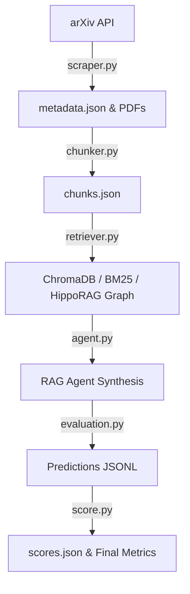

# Agentic RAG: Academic Literature Q&A System

[](https://www.python.org/)
[](https://opensource.org/licenses/MIT)

An advanced, agentic Retrieval-Augmented Generation (RAG) system built to scrape, index, retrieve, reason over, and evaluate academic literature from arXiv. The system implements planning, reflection, hybrid search (dense + sparse + graph), cross-encoder reranking, and citation verification to provide accurate, grounded answers to complex research queries.

---

## Table of Contents
- [Architecture Overview](#architecture-overview)
- [Project Directory Structure](#project-directory-structure)
- [Quick Start: One-Command Reproduction](#quick-start-one-command-reproduction)
- [Detailed Pipeline Components](#detailed-pipeline-components)
  - [1. Scraper](#1-scraper)
  - [2. Chunker](#2-chunker)
  - [3. Indexer & Retriever](#3-indexer--retriever)
  - [4. RAG Agent](#4-rag-agent)
  - [5. Evaluation Pipeline](#5-evaluation-pipeline)
- [Custom Runs & API Key Configuration](#custom-runs--api-key-configuration)

---

## Architecture Overview

The system consists of five decoupled, sequential modules designed for reproducibility and performance:



1. **Scraper**: Queries the arXiv API, parses metadata, and downloads academic PDFs.
2. **Chunker**: Uses `Docling` to extract text and tables (formatted as Markdown) while ignoring references, appendices, and meta-sections.
3. **Indexer & Retriever**: Build a local Vector Store (Chroma with `BAAI/bge-m3` dense embeddings), a sparse index (BM25), and a custom co-citation graph (HippoRAG style pagerank). Candidates are combined using **Reciprocal Rank Fusion (RRF)**, boosted by section importance, and re-ranked using a Cross-Encoder (`BAAI/bge-reranker-large`).
4. **Agent (Actor-Critic)**: Deconstructs questions into focused sub-questions, executes retrieval, reflects on evidence sufficiency (actor-critic loop), synthesizes answers using a citation-guided LLM (Mistral/Gemini/Groq), and filters out ungrounded citations.
5. **Evaluation Pipeline**: Runs batch queries over 30 test questions (factoid, comparative, survey) and scores accuracy and faithfulness using an LLM judge (Mistral).

---

## Project Directory Structure

```
.
├── data/
│   ├── metadata.json              # Scraped paper metadata
│   ├── chunks.json                # Docling parsed text chunks
│   ├── chunks_without_abstract.json
│   ├── chunk_graph.pkl            # Precomputed HippoRAG pagerank graph LFS pointer
│   └── papers/                    # (Gitignored) Downloaded PDF papers
│
├── eval/
│   └── questions.jsonl            # Evaluation questions dataset (30 questions)
│
├── predictions/
│   ├── baseline.jsonl             # Predictions from the baseline model
│   ├── full_agent.jsonl           # Predictions from the full agent
│   └── ablation_*.jsonl           # Predictions for various agent ablations
│
├── src/
│   ├── scraper.py                 # Scrapes papers from arXiv
│   ├── chunker.py                 # Parses and chunks PDFs using Docling
│   ├── retriever.py               # Chroma, BM25, and Graph retrieval logic
│   ├── agent.py                   # Actor-critic planning agent logic
│   ├── baseline.py                # Single-retrieve baseline agent
│   ├── evaluation.py              # Batch run evaluator
│   ├── score.py                   # LLM judge scoring script
│   └── append_abstract.py         # Metadata utility
│
├── requirements.txt               # Project Python dependencies
├── reproduce.py                   # One-step reproduction entrypoint
├── scores.json                    # Final evaluation summary report
└── README.md                      # This documentation file
```

---

## Quick Start: One-Command Reproduction

You can reproduce the evaluation numbers in the report from a fresh clone in a single command. The system automatically initializes database indexes and scores cached predictions to save LLM API costs and time.

### Prerequisite Setup

1. **Clone the Repository**
   ```bash
   git clone https://github.com/<username>/deep-research.git
   cd deep-research
   ```

2. **Set Up Python Virtual Environment**
   ```bash
   python -m venv venv
   # On Windows:
   .\venv\Scripts\activate
   # On Linux/macOS:
   source venv/bin/activate
   ```

3. **Install Dependencies**
   ```bash
   pip install -r requirements.txt
   ```

### The Reproduction Command

Execute the reproduction script:
```bash
python reproduce.py
```

#### What this script does:
1. **Initializes the Retrieval Indices**: Boots up a Chroma DB instance, encodes the preprocessed text chunks (`data/chunks.json`) using `bge-m3` on the GPU (or CPU if CUDA is unavailable), sets up the BM25 index, and initializes the HippoRAG chunk network graph.
2. **Runs the Scoring Judge**: Invokes the LLM Judge (`src/score.py`) using the Mistral client over the precomputed prediction files in `predictions/` to calculate accuracy, faithfulness, citation count, and latency across all configurations.
3. **Prints the Report**: Displays the final comparative scores directly in your terminal.

---

## Detailed Pipeline Components

### 1. Scraper
- **File**: [`src/scraper.py`](file:///e:/deep-research/src/scraper.py)
- **Queries**: Fetches publications from 2024 to April 2026 containing `"LLM Agents"`, `"agentic rag"`, `"tool use language model"`, `"agent memory"`, `"agent benchmarks"`, and `"computer use agents"`.
- **Outputs**: Saves paper metadata to `data/metadata.json` and downloads PDF papers to `data/papers/`.
- **Execution**:
  ```bash
  python src/scraper.py
  ```

### 2. Chunker
- **File**: [`src/chunker.py`](file:///e:/deep-research/src/chunker.py)
- **Engine**: Employs `Docling`'s layout-aware parsing with hardware acceleration options.
- **Rules**:
  - Excludes standard metadata-heavy sections like bibliography, references, appendix, and acknowledgments.
  - Automatically exports structured tables to readable Markdown format and embeds them in the parent text block.
  - Chunks text into sliding windows of max `400 words` with `50 words` overlap.
- **Outputs**: Generates `data/chunks.json`.
- **Execution**:
  ```bash
  python src/chunker.py
  ```

### 3. Indexer & Retriever
- **File**: [`src/retriever.py`](file:///e:/deep-research/src/retriever.py)
- **Features**:
  - **Dense Store**: Vector DB (Chroma) powered by the multi-lingual `BAAI/bge-m3` embeddings.
  - **Sparse Index**: BM25 Okapi stemming using Porter Stemmer for exact keywords.
  - **RRF**: Reciprocal Rank Fusion (RRF) with a default penalty factor ($k=60$) to merge dense and sparse rankings.
  - **Section Importance Boosting**: Boosts chunks falling under important sections (`methods`, `approach`, `results`, `evaluation`) by $+15\%$, and penalizes background/related work by $-20\%$.
  - **Reranking**: Scores the top 50 candidates using a Cross-Encoder (`BAAI/bge-reranker-large`).
  - **HippoRAG Co-citation Graph**: Builds a DiGraph linking paper chunks. It seeds the graph with re-ranked results and uses Personalized PageRank to locate highly connected local context nodes.

### 4. RAG Agent
- **File**: [`src/agent.py`](file:///e:/deep-research/src/agent.py)
- **Architectural Steps**:
  1. **Planner**: Breaks the core query into 3-4 distinct sub-questions under 12 words.
  2. **Retriever**: Queries the hybrid retriever for each sub-question, merging unique results.
  3. **Reflector**: Evaluates the retrieved evidence against the query. If insufficient, it specifies 2 new search queries to execute (max 3 rounds).
  4. **Synthesizer**: Synthesizes the final answer using the collected context, enforcing strict inline citation formats (`[arxiv_id]`).
  5. **Verifier**: Validates that all inline citations are actually present in the context, purging ungrounded claims.

### 5. Evaluation Pipeline
- **Files**: [`src/evaluation.py`](file:///e:/deep-research/src/evaluation.py) and [`src/score.py`](file:///e:/deep-research/src/score.py)
- **Benchmark**: Evaluates agent configs over 30 academic questions in `eval/questions.jsonl`.
- **Ablations Scored**:
  - `full_agent`: The complete planner + reflector + hybrid + verifier agent.
  - `baseline`: Simple single retrieval + generation.
  - `ablation_no_planner`: Agent directly querying the retriever with the user prompt.
  - `ablation_no_reflector`: Agent executing only one retrieval pass.
  - `ablation_no_reranker`: Skipping the Cross-Encoder step.
  - `ablation_no_hyde`: Bypassing Hypothetical Document Embeddings.
  - `ablation_no_verifier`: Generating answers without removing hallucinated citations.
  - `ablation_hippo`: Agent retrieving using the PageRank co-citation graph expansion.

---

## Custom Runs & API Key Configuration

If you want to rerun the evaluation pipeline and generate new predictions using LLMs instead of scoring the cached files, you will need API keys.

1. **Create a `.env` file** at the root of the project:
   ```env
   GROQ_API_KEY=your_groq_api_key
   MISTRAL_API_KEY=your_mistral_api_key
   GEMINI_API_KEY=your_gemini_api_key
   ```

2. **Rerun the entire evaluation pipeline** and regenerate prediction files:
   ```bash
   python reproduce.py --rerun-eval
   ```
